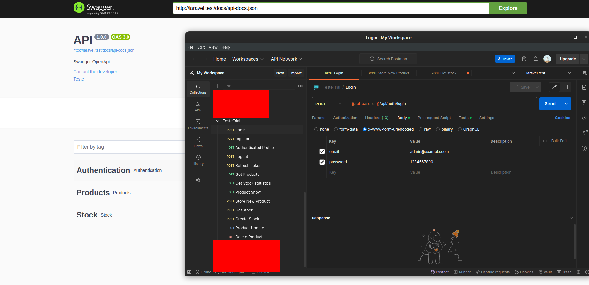
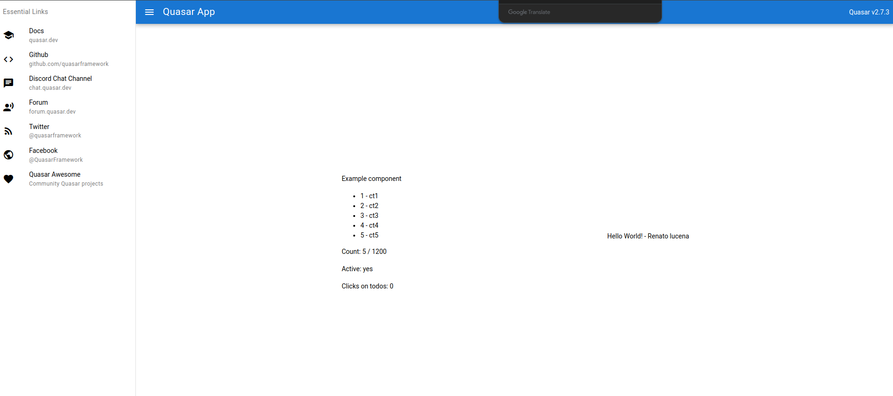
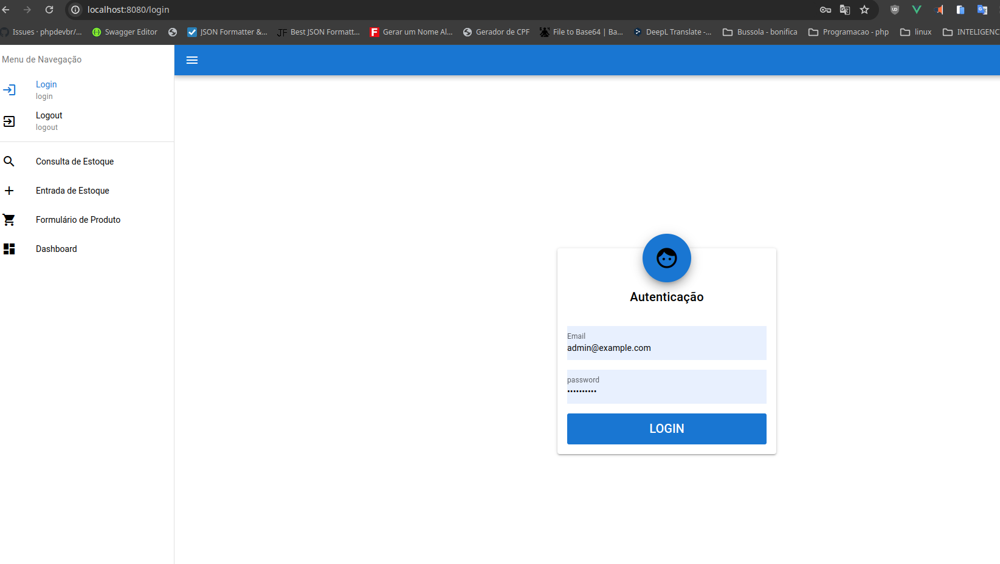
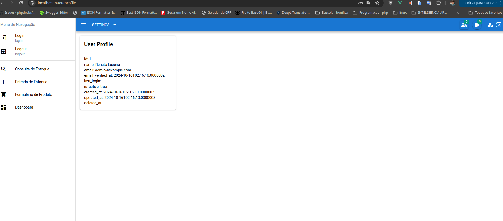
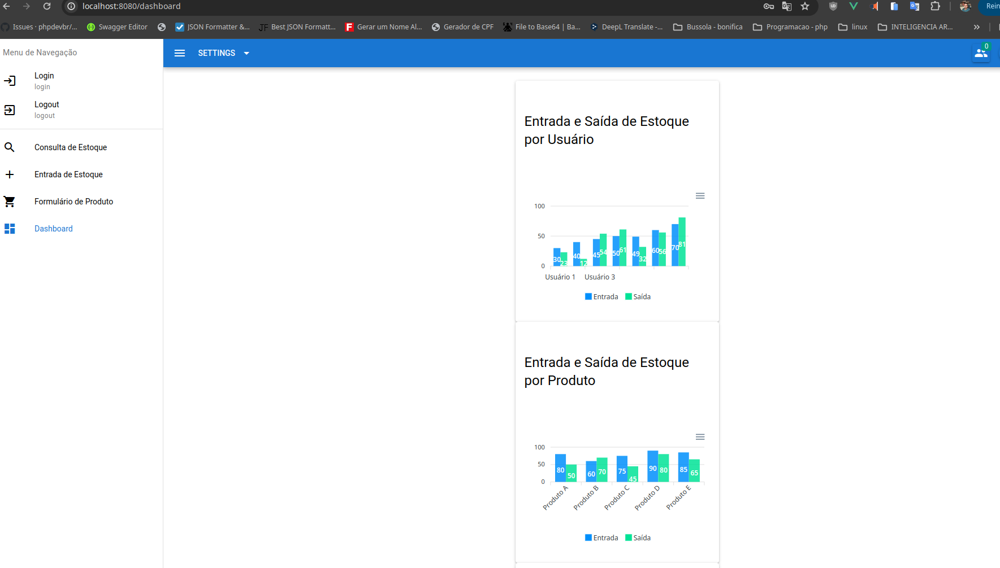

# Teste - Desenvolvedor Full Stack | Laravel + Vue 

- Front-end 
  - i. Quasar 2 
  - ii. Vue 3 com composition API 
  - iii. ApexCharts 
- Back-end 
  - i. PHP ^8.3 
  - ii. Laravel ^9 
  - iii. Docker

## Folders
- Back end(Laravel)
- Front end(Vue.js)








## Como iniciar o projeto

```sh
chmod +x start.sh
./start.sh
```

## Como parar o projeto

```sh
chmod +x stop.sh
./stop.sh
```

> Ambiente que usei para criar o projeto foi Linux(Ubuntu), é onde fico mais a vontade para trabalhar.
> No backend usei Docker Compose, e no frontend usei tambem Docker Compose.

## front se precisar fazer novo build.

`docker exec -i vuejs-app npm run build`

## Docker Desktop no Windows rodando com WSL 2
- https://www.treinaweb.com.br/blog/docker-desktop-no-windows-rodando-com-wsl-2?gclid=Cj0KCQjw4NujBhC5ARIsAF4Iv6cKpdSxMVev4xaqGbjuLT9FlvdfOeJlV0dWPUSQxuhEKaPnZv-c91AaAkPiEALw_wcB